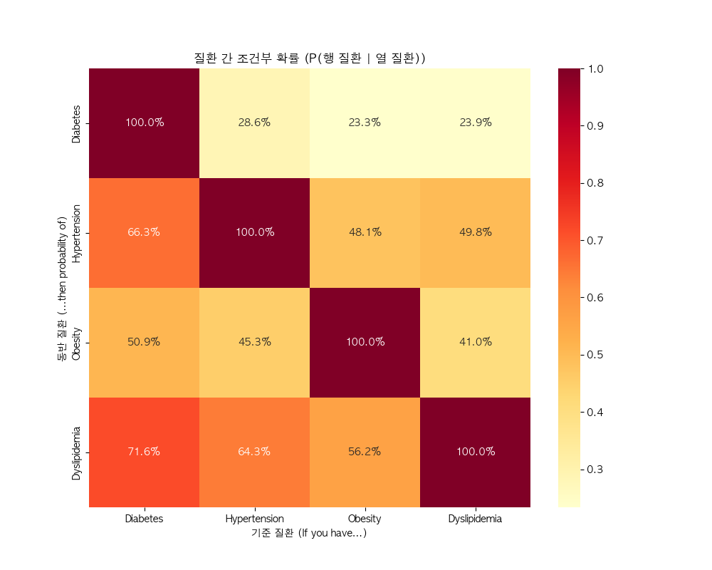

# 🍎 NHANES 기반 다이어트 성공률 시뮬레이터 최종 보고서

본 보고서는 NHANES(미국 국가건강영양조사) 데이터를 활용하여 개발된 '1년 내 10% 체중 감량 성공 예측 모델' 및 이를 기반으로 한 지능형 웹 시뮬레이터의 개발 배경과 기술적 상세 내용을 담고 있습니다.

---

## 1. 프로젝트 개요
- **목적**: 사용자의 신체 지표와 생활 습관을 바탕으로 개인별 감량 성공 확률을 예측하고, 습관 변화에 따른 결과를 시뮬레이션함.
- **데이터 소스**: NHANES 2013-2014 (Demographics, Examination, Questionnaire, Dietary 데이터 통합)
- **성공 정의**: 지난 1년 전 체중 대비 현재 체중이 10% 이상 감소한 경우 (Diet_Success = 1)

---

## 2. 데이터 분석 (EDA): 개발 배경 및 동반 질환(Comorbidity) 분석
EDA 단계에서 수행한 동반 질환 분석 결과, 비만 관리가 만성질환 예방의 핵심 고리임을 확인하였습니다.

### ① 동반 질환 연쇄 고리 분석
- **분석 결과**: 당뇨병(Diabetes)이 있는 환자는 고혈압이나 고지혈증 등 다른 만성 질환을 동시에 가질 확률이 건강한 사람에 비해 압도적으로 높게 나타났습니다.
- **인과관계 추론**: 특히 **비만(Obesity)**은 당뇨 유발의 핵심 인자로 확인되었습니다. 비만 관리를 통해 당뇨 발생률을 낮추면, 결과적으로 다른 연쇄적 만성 질환의 위험까지 줄일 수 있다는 강력한 통계적 근거를 확보했습니다.

*(위 차트는 특정 질환이 있을 때 다른 질환이 동반될 조건부 확률을 보여주며, 비만과 당뇨의 높은 연결성을 증명합니다.)*

### ② 시뮬레이터 개발의 당위성
- 이러한 분석 결과에 기반하여, 만성질환 예방의 첫 단추인 **'다이어트(비만 관리) 성공 여부'**를 과학적으로 예측하고 사용자에게 행동 변화의 지침을 제공하는 시뮬레이터를 개발하게 되었습니다.

---

## 3. 예측 모델링 (AI Engine)
본 프로젝트는 설명 가능성과 예측 안정성을 모두 확보하기 위해 **Hybrid Machine Learning** 방식을 채택하였습니다.

### ① 선택한 알고리즘: Hybrid Model (RF 30% + LR 70%)
- **Random Forest(RF)**: 변수 간의 복잡한 비선형 패턴 및 상호작용 포착.
- **Logistic Regression(LR)**: 시뮬레이션 입력값 변화에 따른 확률의 매끄러운 변화(Sensitivity) 보장.

### ② 머신러닝 vs 딥러닝 비교 (채택 사유)
- **설명 가능성**: 헬스케어 시뮬레이터는 "왜 이 결과가 나왔는가"를 설명하는 것이 중요합니다. 머신러닝은 딥러닝(Black Box)보다 변수 중요도 파악이 훨씬 용이합니다.
- **안정성**: 시뮬레이션 시 특정 구간에서 확률이 튀지 않고 논리적인 곡선을 그리는 데 머신러닝이 더 유리합니다.

---

## 4. 지능형 시뮬레이션 알고리즘 (Correction Layer)
실제 생리적 현상과 사용자 경험을 위해 적용된 3대 핵심 보정 로직입니다.

### ① 목표 체중 기반 난이도 보정 (Difficulty Adjustment)
- **로직**: $최종\ 확률 = 기본\ 확률 \times (10 / 목표\ 감량률)$
- **의미**: 목표가 도전적일수록 확률을 보수적으로 조정하여 현실적인 목표 설정을 유도합니다.

### ② 식단 역설 보정 (Dietary Bias Correction)
- **로직**: 당분 섭취량 증가 시 성공 확률 강제 감점 적용.
- **의미**: 성공한 사람들이 성공 후 더 자유롭게 먹는 통계적 편향을 제거하고 의학적 상식을 반영합니다.

### ③ 운동의 과유불급 (Non-linear Exercise Bell-curve)
- **로직**: 주당 운동 횟수가 일정 수준(3.5~5회)을 넘어서면 가중치가 다시 낮아지는 종 모양 곡선 적용.
- **의미**: 매일 격렬한 운동이 항상 정답은 아니며, 적절한 휴식과 빈도가 감량에 더 효과적임을 시뮬레이션합니다.

---

## 5. 웹 어플리케이션 주요 기능
- **지능형 결측치 보완**: 건강 수치를 모를 경우 연령/BMI 기반 그룹 평균값 자동 대입.
- **6단계 정밀 피드백 시스템**: 0~100% 확률을 6개 구간으로 세분화하여 전문적인 코칭 메시지 제공.
- **사용자 중심 UI**: 홈(개요) - 내 상태 확인(입력) - 시뮬레이션(결과)의 직관적인 3단계 구조.

---

## 6. 결론 및 기대 효과
본 시뮬레이터는 데이터 기반의 동반 질환 분석 결과에서 출발하여, 비만 관리라는 근본적인 건강 문제에 대한 과학적인 해답을 제시합니다. 사용자가 자신의 수치를 입력하고 습관 변화의 효과를 직접 확인하는 과정을 통해, 만성질환 예방을 위한 실질적인 행동 변화를 이끌어낼 것으로 기대됩니다.
